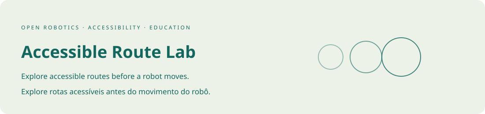

<div align="center">



# Accessible Route Lab

[English](#english) · [Português](#portugues)

**Explore accessible routes before a robot moves.**

[Open the live demo](https://galafis.github.io/accessible-route-lab/) · [Technical design](docs/ARCHITECTURE.md) · [Project guide](docs/RESEARCH.md) · [Contribute](CONTRIBUTING.md)

[](https://github.com/galafis/accessible-route-lab/actions/workflows/ci.yml)


</div>

<a id="english"></a>

## English

An interactive workbench for studying how obstacles, surface cost, and platform clearance affect a route. Edit a synthetic map, compare constraints, inspect written directions, and replay the result in the browser.

## Why this exists

Accessible mobility research begins with questions about people and space. This project makes a small, inspectable part of that work available now: comparing routes and understanding when a passage cannot accommodate a chosen footprint. The intended longer-term application includes supervised robotics research with blind and low-vision people.

## Unitree Go2 PRO research direction

This repository is a **working software prototype in a development program centered on the Unitree Go2 PRO**. It contributes to accessible mobility and supervised robotics research with blind and low-vision people. The implementation, examples, and test suite provide a reviewable software baseline for the next stage of controlled hardware work.

The simulator makes route assumptions inspectable before a physical trial: where the platform would travel, how much space its envelope needs, and why a passage fails. A supported Go2 PRO would allow a later operator-supervised comparison between a prepared course and the simulated map. The written directions are an interface experiment; they are not yet instructions from a robot to a person.

### A concrete Go2 PRO example

A facilitator reproduces a simple corridor in the map, varies clearance, and records the resulting route. After hardware access and an approved test protocol, an operator could compare the same closed course using manufacturer-supported controls. The comparison would document measured clearance, stopping behavior, and discrepancies. No participant would be asked to rely on the prototype for mobility.

**Hardware access matters:** the standard PRO does not include secondary development in Unitree's comparison table. Custom integration therefore requires written vendor confirmation or a supported development configuration. The software currently has no device adapter. [Official Go2 configuration reference](https://www.unitree.com/go2/), checked September 10, 2026.

[Read the Go2 PRO hardware roadmap](docs/UNITREE_GO2_ROADMAP.md) for the proposed setup, measurements, acceptance criteria, and integration boundaries.

## What works today

| Capability                   | Implementation                                                                                        |
| ---------------------------- | ----------------------------------------------------------------------------------------------------- |
| Deterministic route planning | Four-connected A\* with Manhattan distance, stable tie-breaking, and configurable rough-surface cost. |
| Clearance experiments        | Obstacle inflation using a conservative square envelope, including map-edge clearance.                |
| Editable maps                | Place obstacles, rough surfaces, start points, and destinations using a pointer or keyboard.          |
| Inspectable results          | Distance, direction changes, weighted cost, written compass directions, and step-by-step replay.      |
| Portable experiments         | Versioned JSON import/export, strict input validation, and three built-in scenarios.                  |

## Try it in two minutes

1. Open **Narrow passage**. With the point footprint, the route passes through the opening.
2. Set clearance to **Small envelope**. The route becomes unavailable.
3. Select **Open floor** and widen the passage, or compare the other spaces.
4. Use **Next step** to inspect movement, then export the experiment.

## Run locally

Use **Node.js 22 or newer**. No dependency installation, keys, or account is required.

```sh
git clone https://github.com/galafis/accessible-route-lab.git
cd accessible-route-lab
npm test
npm start
```

Open **http://127.0.0.1:4173**. The included development server listens only on your machine. Set the `PORT` environment variable if that port is already in use. The demo is a static application; it can also be hosted by any ordinary static web server. Open it over HTTP, rather than directly from a file, so browser modules load correctly.

## Executable example

The following code runs against the software module, without a robot:

```js
import { makeScenario, planRoute } from './src/planner.js';

const map = makeScenario('narrow-passage');
console.log(planRoute(map, { clearance: 0 }).status); // ready
console.log(planRoute(map, { clearance: 1 }).status); // blocked
```

Open [examples/narrow-passage.json](examples/narrow-passage.json) for a complete input you can import through the demo. The [technical design](docs/ARCHITECTURE.md) documents accepted inputs, outputs, and assumptions.

## Project structure

```text
src/planner.js       Pure domain logic and validation
src/app.js             Browser interaction and rendering
src/browser.js         Import, export, and text escaping
test/                  Behavioral regression tests
examples/              Synthetic, versioned JSON examples
docs/                  Architecture, evaluation, and facilitator material
scripts/serve.mjs       Local static development server
.github/workflows/     Linux and Windows checks on Node 22 and 24
```

## Verification

The initial release includes **19 automated tests**. Run `npm test` for the behavioral suite or `npm run test:coverage` for a local coverage report. The workflow runs the same suite on Linux and Windows with Node 22 and 24. See [validation notes](docs/VALIDATION.md) for the tested properties and remaining review work.

## Status and boundaries

This release is a working software simulation. It has no robot connection, live localization, obstacle sensor input, or validated guidance capability. Coordinates, surfaces, and route costs are synthetic. It is not suitable for directing a person through a physical environment.

This is an independent project by **Gabriel Demetrios Lafis**. It does not claim endorsement by a hardware vendor, university, emergency service, or clinical organization. Institutional contact: **gabrieldemetrioslafis@usp.br**.

## Related open projects

[Rescue Scenario Lab](https://github.com/galafis/rescue-scenario-lab) · [Inclusive Session Studio](https://github.com/galafis/inclusive-session-studio)

The projects form a small portfolio for accessible mobility research, rescue education, and inclusive activity planning. They share a commitment to inspectable software and clear limits on demonstrated capability.

## Contributing and license

See [CONTRIBUTING.md](CONTRIBUTING.md) and [SECURITY.md](SECURITY.md). The source and documentation are available under the [MIT license](LICENSE). Suggestions from people with lived experience and relevant practitioners are especially welcome.

---

<a id="portugues"></a>

## Português

**[Abrir demonstração](https://galafis.github.io/accessible-route-lab/)** · [Arquitetura](docs/ARCHITECTURE.md) · [Guia do projeto](docs/RESEARCH.md) · [Roteiro de desenvolvimento com Go2 PRO](docs/UNITREE_GO2_ROADMAP.md)

### O que é este projeto

Bancada interativa para estudar como obstáculos, superfícies e folga alteram uma rota. É possível editar um mapa sintético, comparar restrições, ler as instruções do percurso e reproduzir cada deslocamento no navegador.

É um **protótipo funcional de software em um programa de desenvolvimento direcionado ao Unitree Go2 PRO**. Sua contribuição está ligada a mobilidade acessível e pesquisa supervisionada em robótica com pessoas cegas ou com baixa visão. A implementação, os exemplos e a suíte de testes formam uma base de software verificável para a próxima etapa de trabalho controlado com o equipamento.

### Direção de pesquisa com o Unitree Go2 PRO

O simulador torna as premissas de uma rota verificáveis antes de um ensaio físico: por onde a plataforma passaria, quanto espaço seu envelope ocupa e por que uma passagem se torna inviável. Um Go2 PRO disponibilizado com suporte permitiria comparar, em uma etapa posterior e sob supervisão de um operador, um percurso preparado com o mapa simulado. As instruções textuais são um experimento de interface; ainda não são orientações emitidas por um robô para uma pessoa.

**Exemplo concreto:** Um facilitador reproduz um corredor simples no mapa, varia a folga e registra a rota resultante. Após acesso ao equipamento e definição de um protocolo de ensaio, um operador poderia comparar o mesmo percurso fechado usando controles suportados pelo fabricante. A comparação documentaria folga medida, comportamento de parada e divergências. Nenhum participante dependeria do protótipo para se locomover.

**Acesso ao equipamento:** a configuração PRO padrão não inclui desenvolvimento secundário na tabela da Unitree. Integrações personalizadas dependem de confirmação escrita do fabricante ou de uma configuração de desenvolvimento suportada. Este software ainda não possui adaptador para o robô. Consulte a [referência oficial de configurações Go2](https://www.unitree.com/go2/), verificada em 10 de setembro de 2026.

### Funcionalidades implementadas

| Capacidade                  | Implementação                                                                                                               |
| --------------------------- | --------------------------------------------------------------------------------------------------------------------------- |
| Planejamento determinístico | A\* com movimentos ortogonais, distância de Manhattan, desempate estável e custo configurável para superfícies irregulares. |
| Experimentos de folga       | Expansão conservadora dos obstáculos por um envelope quadrado, incluindo as bordas do mapa.                                 |
| Edição acessível            | Obstáculos, piso irregular, início e destino podem ser alterados com ponteiro ou teclado.                                   |
| Resultados verificáveis     | Distância, mudanças de direção, custo ponderado, instruções textuais e reprodução passo a passo.                            |
| Experimentos portáteis      | Importação e exportação JSON com versão, validação dos dados e três cenários incluídos.                                     |

### Experimente em dois minutos

1. Abra **Narrow passage**. Com o envelope pontual, a rota atravessa a abertura.
2. Selecione **Small envelope**. A passagem fica indisponível.
3. Use **Open floor** para ampliar a abertura ou compare os outros mapas.
4. Avance com **Next step** e exporte o experimento.

A interface da demonstração e os documentos técnicos estão em inglês. Este README apresenta a explicação completa em inglês e português. Todos os exemplos usam informações sintéticas.

### Executar localmente

Requisito: **Node.js 22 ou superior**. Não é necessário instalar dependências, fornecer chaves ou criar uma conta.

```sh
git clone https://github.com/galafis/accessible-route-lab.git
cd accessible-route-lab
npm test
npm start
```

Abra **http://127.0.0.1:4173**. O servidor de desenvolvimento aceita conexões apenas da própria máquina. Se a porta estiver ocupada, configure a variável de ambiente `PORT`. A aplicação também pode ser publicada em um servidor comum de arquivos estáticos. Use HTTP, em vez de abrir o HTML diretamente como arquivo, para permitir o carregamento dos módulos.

### Exemplo executável

Este código executa o módulo do protótipo e não envia comandos ao equipamento:

```js
import { makeScenario, planRoute } from './src/planner.js';

const map = makeScenario('narrow-passage');
console.log(planRoute(map, { clearance: 0 }).status); // ready
console.log(planRoute(map, { clearance: 1 }).status); // blocked
```

O arquivo [examples/narrow-passage.json](examples/narrow-passage.json) é um exemplo completo para importar pela demonstração. A [documentação de arquitetura](docs/ARCHITECTURE.md) explica formatos, resultados e premissas.

### Organização do repositório

| Caminho              | Finalidade                                                |
| -------------------- | --------------------------------------------------------- |
| `src/planner.js`     | Regras do domínio e validação, independentes da interface |
| `src/app.js`         | Interações e apresentação no navegador                    |
| `src/browser.js`     | Importação, exportação e tratamento de texto              |
| `test/`              | Testes de comportamento e regressão                       |
| `examples/`          | Entradas JSON sintéticas e reproduzíveis                  |
| `docs/`              | Arquitetura, avaliação e material de facilitação          |
| `scripts/serve.mjs`  | Servidor estático de desenvolvimento local                |
| `.github/workflows/` | Verificações em Linux e Windows, com Node 22 e 24         |

### Testes e verificação

A versão inicial contém **19 testes automatizados**. Execute `npm test` para reproduzir a suíte, ou `npm run test:coverage` para gerar um relatório local de cobertura. O status de cada commit pode ser consultado na aba **Actions**.

A suíte verifica continuidade das rotas, obstáculos, folga, rejeição de entradas inválidas, imutabilidade e determinismo. Também compara o planejador com uma busca em largura independente em 80 mapas gerados com semente fixa.

As [notas de validação](docs/VALIDATION.md) distinguem as verificações de software das avaliações ainda necessárias com tecnologias assistivas, participantes e profissionais.

### Estado atual e próximos passos

Não há conexão com robô, localização ao vivo, leitura de sensores ou orientação física validada. Os mapas são sintéticos. Pessoas em movimento, incerteza dos sensores, aderência, inclinação, raio de giro e frenagem de emergência estão fora desta versão.

1. **Disponível:** software funcional, demonstração, testes, exemplos e documentação.
2. **Proposto:** revisão participativa e avaliação por profissionais da área, com procedimentos adequados de consentimento e privacidade.
3. **Etapa de equipamento:** acesso ao Go2 PRO, confirmação dos recursos suportados e demonstrações físicas controladas.
4. **Dependente de desenvolvimento e validação adicionais:** qualquer integração programática ou uso com participantes que envolva equipamento físico.

### Autoria, colaboração e licença

Projeto independente de **Gabriel Demetrios Lafis**. Contato institucional: **gabrieldemetrioslafis@usp.br**. Não representa endosso de fabricante, universidade, serviço de emergência ou organização clínica.

Contribuições são bem-vindas conforme [CONTRIBUTING.md](CONTRIBUTING.md). Consulte [SECURITY.md](SECURITY.md) para relatar vulnerabilidades. Código e documentação estão sob a [licença MIT](LICENSE).

Projetos relacionados: [Accessible Route Lab](https://github.com/galafis/accessible-route-lab), [Rescue Scenario Lab](https://github.com/galafis/rescue-scenario-lab) e [Inclusive Session Studio](https://github.com/galafis/inclusive-session-studio).

[Voltar ao início](#english)
