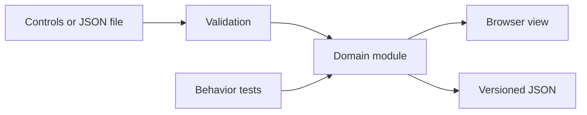

# Technical design

Accessible Route Lab uses browser-native modules and a pure domain module that also runs under Node. The application has no backend, runtime package dependencies, external fonts, or analytics. The UI and tests consume the same implementation.



## Planner contract

```js
import { makeScenario, planRoute, routeInstructions } from './src/planner.js';

const map = makeScenario('courtyard');
const result = planRoute(map, { clearance: 1, roughCost: 4 });
console.log(result.status, result.distance, result.cost);
console.log(routeInstructions(result.path, map.cellSize));
```

`planRoute` validates and copies the map. It returns `ready` or `blocked`, a reason, the path as `[x, y]` pairs, visited indices, blocked cells, distance in metres, weighted cost, and direction changes. A blocked route has an empty path and a null cost. Identical endpoints produce one path point and zero distance.

The open set is scanned for the lowest `g + h`; equal scores use the lower cell index. Every move is orthogonal and costs at least one, so Manhattan distance remains an admissible heuristic. Closed nodes do not need reopening under these costs. The small-grid implementation favors inspectability over asymptotic optimization: worst-case selection work is quadratic in the number of cells. Grids are bounded at 40 × 40.

Clearance is a whole-number radius of 0–4 cells. A radius of one checks a 3 × 3 square around each candidate cell, including the map boundary. This is a conservative footprint approximation, not a geometric model of a legged robot. Rough cells cost 1–20 units to enter; the default is four. Reported physical distance depends only on step count and cell size, not terrain cost.

## Coordinate and file contract

The origin is the upper-left cell; x increases east and y increases south. `cells` is a flat row-major array. Values are `0` for floor, `1` for obstacle, and `2` for rough surface. Width and height are 4–40; `cellSize` is 0.1–2 metres. Start and goal must be in bounds and on non-obstacle cells.

Exports contain the input scenario plus an `experiment` object. Import reads the scenario and intentionally recalculates the result using the controls currently selected in the browser. It does not trust an imported path, cost, or claimed result. Import does not restore experiment control settings.

## Interface behavior

Editing or changing a constraint stops playback and recalculates. The grid has one tab stop and arrow-key navigation. Enter edits the selected cell. Written directions remain available independently of replay. A route at the destination cannot be played. No map is persisted automatically; export is the explicit way to keep an experiment.

## Hosting and maintenance

The repository root is deployable as static files on GitHub Pages. `.nojekyll` prevents template processing. The development server rejects hidden and out-of-root paths; it is not intended as an internet-facing production service. GitHub Actions has read-only repository permissions. There is no build step and no package lockfile because there are no package dependencies.
