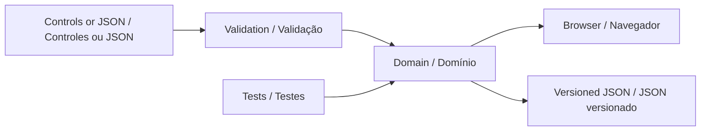

# Technical design

<!-- bilingual-support -->

[English](#english) · [Português](#português)

## English

Accessible Route Lab uses browser-native modules and a pure domain module that also runs under Node. The application has no backend, runtime package dependencies, external fonts, or analytics. The UI and tests consume the same implementation.



## Planner contract

```js
import { makeScenario, planRoute, routeInstructions } from './src/planner.js';

const map = makeScenario('courtyard');
const result = planRoute(map, { clearance: 1, roughCost: 4 });
console.log(result.status, result.distance, result.cost);
console.log(routeInstructions(result.path, map.cellSize));
```

`planRoute` validates and copies the map. It returns `ready` or `blocked`, a reason, the path as `[x, y]` pairs, visited indices, blocked cells, distance in metres, weighted cost, and direction changes. A blocked route has an empty path and a null cost. Identical endpoints produce one path point and zero distance.

The open set is scanned for the lowest `g + h`; equal scores use the lower cell index. Every move is orthogonal and costs at least one, so Manhattan distance remains an admissible heuristic. Closed nodes do not need reopening under these costs. The small-grid implementation favors inspectability over asymptotic optimization: worst-case selection work is quadratic in the number of cells. Grids are bounded at 40 × 40.

Clearance is a whole-number radius of 0–4 cells. A radius of one checks a 3 × 3 square around each candidate cell, including the map boundary. This is a conservative footprint approximation, not a geometric model of a legged robot. Rough cells cost 1–20 units to enter; the default is four. Reported physical distance depends only on step count and cell size, not terrain cost.

## Coordinate and file contract

The origin is the upper-left cell; x increases east and y increases south. `cells` is a flat row-major array. Values are `0` for floor, `1` for obstacle, and `2` for rough surface. Width and height are 4–40; `cellSize` is 0.1–2 metres. Start and goal must be in bounds and on non-obstacle cells.

Exports contain the input scenario plus an `experiment` object. Import reads the scenario and intentionally recalculates the result using the controls currently selected in the browser. It does not trust an imported path, cost, or claimed result. Import does not restore experiment control settings.

## Interface behavior

Editing or changing a constraint stops playback and recalculates. The grid has one tab stop and arrow-key navigation. Enter edits the selected cell. Written directions remain available independently of replay. A route at the destination cannot be played. No map is persisted automatically; export is the explicit way to keep an experiment.

## Hosting and maintenance

The repository root is deployable as static files on GitHub Pages. `.nojekyll` prevents template processing. The development server rejects hidden and out-of-root paths; it is not intended as an internet-facing production service. GitHub Actions has read-only repository permissions. There is no build step and no package lockfile because there are no package dependencies.

## Português

### Contrato do planejador

O módulo `src/planner.js` funciona no navegador e no Node. O exemplo da seção em inglês usa `makeScenario`, `planRoute` e `routeInstructions` diretamente; execute-o a partir da raiz do repositório com Node em modo de módulo.

`planRoute` valida e copia o mapa e retorna `ready` ou `blocked`, motivo, caminho em pares `[x, y]`, índices visitados, células bloqueadas, distância em metros, custo ponderado e mudanças de direção. Uma rota bloqueada tem caminho vazio e custo `null`. Origem e destino iguais produzem um ponto e distância zero.

A busca A\* seleciona o menor `g + h`, desempata pelo menor índice de célula e permite apenas movimentos ortogonais. Como cada movimento custa pelo menos um, a distância Manhattan é uma heurística admissível e consistente; não é necessário reabrir nós fechados. A seleção por varredura torna o pior caso quadrático no número de células. O limite é 40 × 40.

A folga é um raio inteiro de 0 a 4 células. Raio 1 verifica um quadrado 3 × 3 em torno da célula, inclusive os limites do mapa. É uma aproximação conservadora, sem representar a geometria dinâmica de um quadrúpede. Entrar em terreno irregular custa de 1 a 20 unidades, com padrão 4. Distância física depende apenas da quantidade de passos e da escala, sem incorporar a penalidade do terreno.

### Coordenadas e arquivos

A origem fica no canto superior esquerdo; x cresce para leste e y para sul. `cells` é um vetor por linhas: `0` representa piso, `1` obstáculo e `2` superfície irregular. Largura e altura vão de 4 a 40; `cellSize`, de 0,1 a 2 metros. Origem e destino precisam estar dentro do mapa, em células sem obstáculo.

A exportação inclui o cenário e um objeto `experiment`. A importação recalcula o resultado com os controles atuais do navegador: não aceita como verdade um caminho ou custo importado e não restaura os controles do experimento automaticamente.

### Comportamento da interface

Editar o mapa ou alterar uma restrição interrompe a reprodução e recalcula a rota. O mapa tem uma única parada na navegação por Tab, setas entre células e Enter para editar. As instruções escritas são independentes da reprodução. Uma rota já no destino não pode ser reproduzida. O mapa não é salvo automaticamente; exportar é a forma explícita de preservar o experimento.

### Hospedagem e manutenção

A aplicação usa módulos nativos, sem servidor de aplicação, dependências de execução, fontes externas ou análise de uso. A interface e os testes usam a mesma implementação do domínio. A raiz pode ser hospedada como arquivos estáticos no GitHub Pages; `.nojekyll` evita processamento de templates. O servidor local recusa caminhos ocultos e fora da raiz, escuta apenas em `127.0.0.1` e não é um serviço de produção. O workflow de testes usa permissões de leitura. Não há etapa de compilação nem dependências a instalar.

### Language presentation · Apresentação do idioma

`src/i18n.js` translates visible text and accessible labels at the view boundary. It observes dynamic view updates and retains the original text for reversible language switching. It does not rebuild controls or mutate domain state. Text marked `data-verbatim`, including authored session invitations, stays unchanged. The language preference uses `portfolio.language.v1`; storage failure does not prevent use.

`src/i18n.js` traduz texto visível e rótulos acessíveis na camada de apresentação. Observa atualizações da interface e preserva o texto original para permitir a troca reversível. Não recria controles nem altera o estado do domínio. Textos com `data-verbatim`, incluindo convites editados, permanecem iguais. A preferência usa `portfolio.language.v1`; falhas de armazenamento não impedem o uso.
